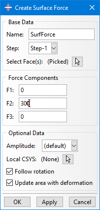

# Abaqus Plugin: Surface Force
Plugin for Abaqus/CAE to apply a general force on a surface

 
More details:

This Plug-In allows to quickly apply a general force to faces. Why is that useful? In Abaqus/CAE you can apply general forces (3 components in 3D space) only at points/nodes. You can also apply a pressure load as force, but here the load is always normal to the face. And you can define a Surface Traction load, but here you have to calculate the force magnitude and face area yourself first and enter the value as “force per area”.

Unfortunately there is no built-in option to apply a general force directly to selected faces. So this is what my Plug-In is for. When executed, it will calculate the area of the selected faces, the force magnitude and the resulting force direction. This is used to create the resulting Surface Traction load.

The short video below shows that on a simple example. Be aware that the Plug-In is only for creating the load. Afterwards you have the Surface Traction and you can edit, suppress, move, delete, etc. that feature.

See also video in media folder.

 

<video width="820" height="444" controls>
  <source src="https://raw.githubusercontent.com/MattE4/Abaqus_Plugin_Surface-Force/master/media/Plugin_SurfaceForce.mp4" type="video/mp4">
</video>

Usage at your own risk.